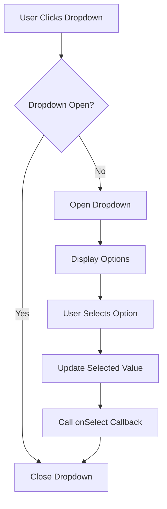
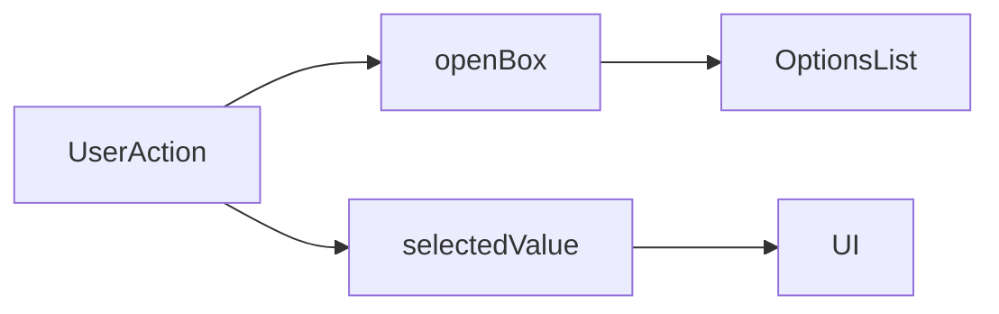

# Welcome to your Expo app 👋

This is an [Expo](https://expo.dev) project created with [`create-expo-app`](https://www.npmjs.com/package/create-expo-app).

## Get started

1. Install dependencies

   ```bash
   npm install
   ```

2. Start the app

   ```bash
   npx expo start
   ```

In the output, you'll find options to open the app in a

- [development build](https://docs.expo.dev/develop/development-builds/introduction/)
- [Android emulator](https://docs.expo.dev/workflow/android-studio-emulator/)
- [iOS simulator](https://docs.expo.dev/workflow/ios-simulator/)
- [Expo Go](https://expo.dev/go), a limited sandbox for trying out app development with Expo

You can start developing by editing the files inside the **app** directory. This project uses [file-based routing](https://docs.expo.dev/router/introduction).

## Get a fresh project

When you're ready, run:

```bash
npm run reset-project
```

This command will move the starter code to the **app-example** directory and create a blank **app** directory where you can start developing.

### Other setup steps

- To set up ESLint for linting, run `npx expo lint`, or follow our guide on ["Using ESLint and Prettier"](https://docs.expo.dev/guides/using-eslint/)
- If you'd like to set up unit testing, follow our guide on ["Unit Testing with Jest"](https://docs.expo.dev/develop/unit-testing/)
- Learn more about the TypeScript setup in this template in our guide on ["Using TypeScript"](https://docs.expo.dev/guides/typescript/)

## Learn more

To learn more about developing your project with Expo, look at the following resources:

- [Expo documentation](https://docs.expo.dev/): Learn fundamentals, or go into advanced topics with our [guides](https://docs.expo.dev/guides).
- [Learn Expo tutorial](https://docs.expo.dev/tutorial/introduction/): Follow a step-by-step tutorial where you'll create a project that runs on Android, iOS, and the web.

## Join the community

Join our community of developers creating universal apps.

- [Expo on GitHub](https://github.com/expo/expo): View our open source platform and contribute.
- [Discord community](https://chat.expo.dev): Chat with Expo users and ask questions.

###

# React Dropdown Component

# Dropdown Component

A reusable React dropdown component that allows users to select an option from a list.

## Features

- Displays a list of selectable options.
- Supports custom placeholder text.
- Shows the selected value.
- Toggles open and close on click.
- Calls a callback function when an item is selected.

## Props

| Prop        | Type          | Description                     |
| ----------- | ------------- | ------------------------------- |
| data        | Array<Object> | Array of items to display       |
| placeholder | string        | Text shown before selection     |
| value       | string        | Selected value (optional)       |
| onSelect    | function      | Called when an item is selected |
| id          | string        | Key used to identify items      |

## Usage

```jsx
const students = [
  { name: "Manas", rollNo: 1 },
  { name: "Khushi", rollNo: 2 },
  { name: "Misty", rollNo: 3 },
];

<DropDown
  data={students}
  placeholder="Select Student"
  id="name"
  onSelect={(student) => console.log(student)}
/>;
```

## Component Flow



## State Management



## Example Behavior

1. User clicks the dropdown.
2. The options list becomes visible.
3. User selects an item.
4. The selected item is displayed.
5. The `onSelect` callback is triggered.
6. The dropdown closes automatically.

## Technologies Used

- React
- TypeScript
- Tailwind CSS
- Ionicons

```

```
